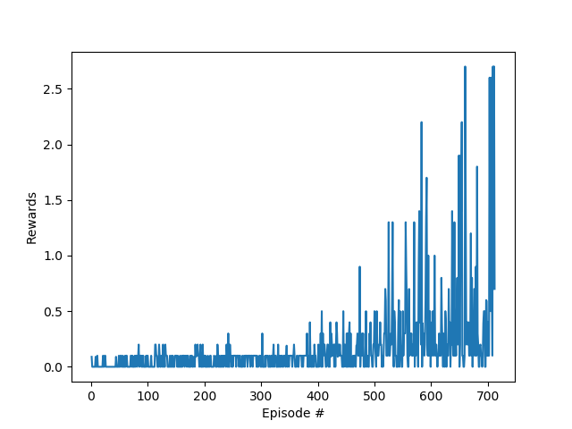

# PPO Tennis implementation

In this project two agents are playing tennis to reach average score of 0.5 over 100 episodes taking maximum over scores of the episode.

## 1. Learning algorithm

I have chosen [PPO](https://arxiv.org/abs/1707.06347) as a learning algorithm. It showed outstanding performance and now I believe in reinforcement learning. 

1. First we get data from an enviroment. And save it.

2. We iterate through this data backwards and calculating returns and advantages.

```
returns = rewards + self.config['hyperparameters']['discount_rate'] * dones * returns

td_error = rewards + self.config['hyperparameters']['discount_rate'] * dones * next_value.detach() - value.detach()
advantages = advantages * self.config['hyperparameters']['tau'] * self.config['hyperparameters']['discount_rate'] * dones + td_error
```

3. Then we shuffle indicies.

4. Using advantages and returns we calculate `policy_loss` and `value_loss`:

```
_, log_probs, entropy_loss, values = self.ap(sampled_states, sampled_actions)
ratio = (log_probs - sampled_log_probs_old).exp()
obj = ratio * sampled_advantages
obj_clipped = ratio.clamp(1.0 - self.config['hyperparameters']['ppo_clip'],
                          1.0 + self.config['hyperparameters']['ppo_clip']) * sampled_advantages
policy_loss = -torch.min(obj, obj_clipped).mean(0) - self.config['hyperparameters']['entropy_coefficent'] * entropy_loss.mean()

```

5. Then we apply backpropagation to the `policy_loss` and `value_loss`:

```
(policy_loss + value_loss).backward()

```

6. Not forgetting to clip the gradients which is a key component of PPO paper:

```
nn.utils.clip_grad_norm_(self.ap.parameters(), self.config['hyperparameters']['gradient_clip'])
```


# 2. Hyperparameters

```
config = {
    'environment': {
        'state_size': env_info.vector_observations.shape[1],
        'action_size': 2,
        'number_of_agents': 1
    },
    'pytorch': {
        'device': "cpu"
    },
    'hyperparameters': {
        'hidden_size': 64,
        'discount_rate': 0.99,
        'tau': 0.95,
        'gradient_clip': 5,
        'rollout_length': 2048,
        'adam_learning_rate': 3e-4,
        'adam_epsilon': 1e-5,
        'optimization_epochs': 10,
        'ppo_clip': 0.2,
        'entropy_coefficent': 0.01,
        'mini_batch_number': 32,
    }
}
```

I have chosen dictionary as a fast and convinient way to store the data. 

`state_size`, `action_size` is provided by the environment.

`number_of_agents` is an important parameters as we are training two agents independenlty. I tried to use them together but with minor results.

`'device': "cpu"` - I was forced to use `cpu` because we have to use PyTorch 0.4.0 which is compiled for CUDA 8.0 but my card is supported starting from CUDA 9.0.

`hidden_size` - number of neurons plays an important part in an implementation. Although 128 neurons converge 50 epochs faster but I couldn't make agents act differently. Of course it mostly depends on gradient initialization but at 64 it plays like two humans.

`discount_rate` - controls how future data is discounted. This is very well known formula in finance. I am happy to see that in reinforcement learning. I experimented with different values and 0.99 seems to viable parameter.

`gradient_clip` - narrows the gradient but stabilizes the training.

`rollout_length` - on how many micro episodes algorithm learns. Choosing too small number degradates the training results and lead to longer convergence.

`ppo_clip` - controls clamp of the `ratio = (log_probs - sampled_log_probs_old).exp()`. It showed that clamping helps to narrow training and improve results.

`adam_learning_rate` - 0.0005 my magic number for Adam. But for this particular case. `3e-4` works better.

`entropy_coefficient` - parameter of `policy_loss`.


# 3. Model

I have chosen three layers because I wanted to see real or in other words different performance of two agents. I had convergence when two players act identically but it is not interesting. Although with fewer layers algorithm shows more immediate results but fails to get above 0.27 mean 100. Below is a part of a neural network that was used in Actor and Critic part.

```
class FC_VAR(nn.Module):
    
    def __init__(self, state_size, output_size, hidden_size, output_gate=None):
        super(FC_VAR, self).__init__()
        self.linear1 = nn.Linear(state_size, hidden_size)
        self.linear2 = nn.Linear(hidden_size, hidden_size)
        self.linear3 = nn.Linear(hidden_size, output_size)
        self.output_gate = output_gate

    def forward(self, x):
        x = F.relu(self.linear1(x))
        x = F.relu(self.linear2(x))
        x = self.linear3(x)
        if self.output_gate:
            x = self.output_gate(x)
        return x
```

# 4. Improvement

1. Fewer layers and hidden neurons might be used to converge faster.
2. Batch normalization can be used to improve performance.
3. Clipping is a key success factor of PPO. Playing for more optimal clipping is posssible.
4. Code might be converted to pure PyTorch tensor operations and it will improve speed. Also it might be nice to have an output of an environment as PyTorch tensors. CUDA in this case can be a valuable addition.
5. `rollout_length` plays an important part in training. Finding right value is hard considering other parameters but is possible.


# 5. Plot of rewards



# 6. Credits

I got an idea of implementation and implemented from the scratch. Two sources that I want to mention: 
1. [Shangtong Zhang](https://github.com/ShangtongZhang/DeepRL)
2. [Jeremi Kaczmarczyk](https://github.com/jknthn/reacher-ppo)


```python

```
